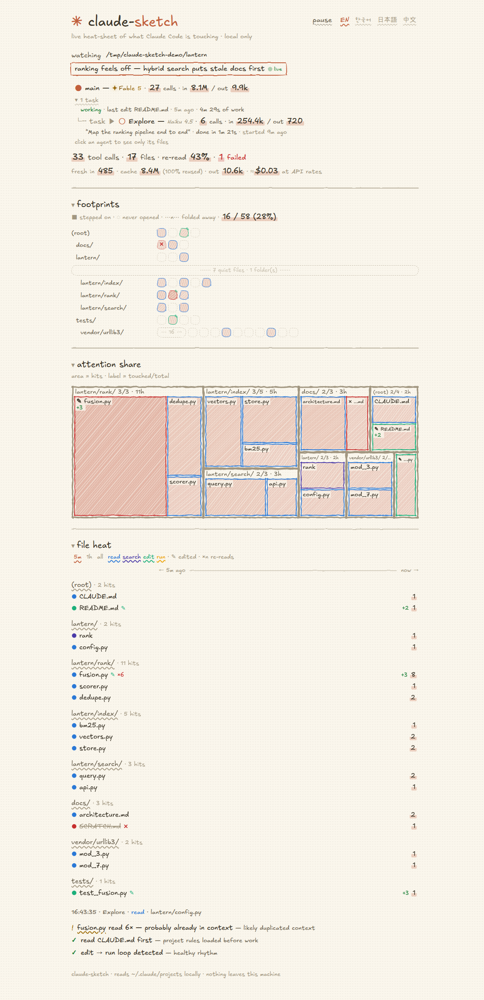

# ✳ claude-sketch

**English** · [한국어](README.ko.md) · [日本語](README.ja.md) · [中文](README.zh.md)

> 🕵️ Claude just read `fusion.py` for the sixth time — and took a stroll through `vendor/`.
> You had no idea. Now you do.

A crayon sketch of what **Claude Code** is touching in your repo, live. 🖍️

```bash
npx claude-sketch
```

<picture>
  <source media="(prefers-color-scheme: dark)" srcset="docs/screenshot-dark.png">
  
</picture>

<picture>
  <source media="(prefers-color-scheme: dark)" srcset="docs/live-dark.gif">
  
</picture>


## 👀 What you get

- 👣 **footprints** — every file in the repo; filled = stepped on, dashed = walked past, `⋯16⋯` = never went near. Coverage counted against the repository the session actually worked in — tracked files plus anything not ignored.
- 🎯 **attention share** — treemap where **area = tool calls**. One file eating a third of the frame *is* the warning.
- 🔥 **file heat** — 5m / 1h / whole session. Read-read-edit-run… or read-read-read-read. 😬
- 📂 **folder picker** — the header lists every folder Claude Code has ever worked in (recovered from the transcripts themselves); switch without restarting.
- 🧠 **agents** — `main ─task▶ subagents`, each with model, brief, status, duration. Click one to filter everything to it.
- 📝 **margin notes** — "read 6×, probably already in context", "poking `vendor/` 9×", "edit → run loop 👍".
- ✂️ **deletions & diffs** — `rm` inside a Bash call shows up struck through; edits carry `+12 −3`.

## 💸 The number nobody expects

```
fresh in 485 · cache 8.4M (100% reused) · out 10.6k · ≈$0.03 at API rates
```

Claude replays your whole context from cache every turn. "8.4M input tokens" 😱 is
meaningless — the number that costs you is **485**. Rates live in
`~/.claude-sketch.pricing.json`; on a subscription you're not billed per token at
all, so read it as *size of work*, not a bill. Failed calls get counted too — pure waste. ❌

## 🎛️ Options

| | |
|---|---|
| `-p, --project <dir>` | what to watch (default: cwd) |
| `--port <n>` | default 4517 — **hops to the next free port if busy** |
| `--strict-port` | fail instead of hopping |
| `-d, --detach` | run in the background, hand the terminal back |
| `--host <addr>` | default `127.0.0.1` (anything else warns loudly ⚠️) |
| `--open` / `--no-open` | browser or no browser |
| `-v, --version` · `-h, --help` | 🙂 |

## ⚙️ How it works

Claude Code already writes every event to `~/.claude/projects/<slug>/<session>.jsonl`
(subagents in `<session>/subagents/**`), or wherever `CLAUDE_CONFIG_DIR` points. claude-sketch
watches and tails those files, pulls out
`tool_use` + `message.model` + `message.usage`, and streams it to the browser over SSE.

**Measured, not guessed.** No DB, no build step, no framework, **zero dependencies**. 📦

## ⚡ Performance

| | |
|---|---|
| idle CPU, browser attached | **0.06 %** of a core |
| memory | ~60 MB (worst seen: 105 MB) |
| 260 MB transcript, cold parse | **1.7 s** |
| a tool call reaching the browser | **41 ms** (worst 121 ms under 8 parallel agents) |
| polled endpoints (`/api/sessions`) | 1–5 ms |
| switching to a 115-session project | 50 ms, then ~1 ms |
| full browser re-render | ~30 ms, 4 MB heap |

## 🔒 Privacy

Read-only where it matters: nothing under your project or `~/.claude` is ever written to.
The one file it does write is a marker in the temp dir, so a restart can tell whether a tab
is already open. Binds `127.0.0.1`, and refuses any request that arrives under a domain
name or from another origin. Clicking a file **asks first**. Zero outbound requests — fonts are bundled, so
it works on a plane. 🏠

## 🎨 Details

- **Language**: 🇬🇧 🇰🇷 🇯🇵 🇨🇳 — one row in the header, one object in `I18N` to add more.
- **Fonts**: Excalifont (Latin), Gaegu (Hangul), Klee One (Japanese), Ma Shan Zheng
  (Chinese) — all **SIL Open Font License 1.1**, bundled and subset; see
  [`public/fonts/README.md`](public/fonts/README.md) for what each covers and how to
  rebuild. Swap any of them via the `--hand` CSS variable.
- **`n calls · 0 files`** is real, not a bug — shell commands don't point at files.
- Task duration = the longer of *spawn→result* and *the agent's own first→last call*
  (some transcripts write those 0.1 s apart 🙃).

## 📄 License

MIT. Not an official Anthropic product — just a tool for people who like knowing what
their agent is up to. ✳
