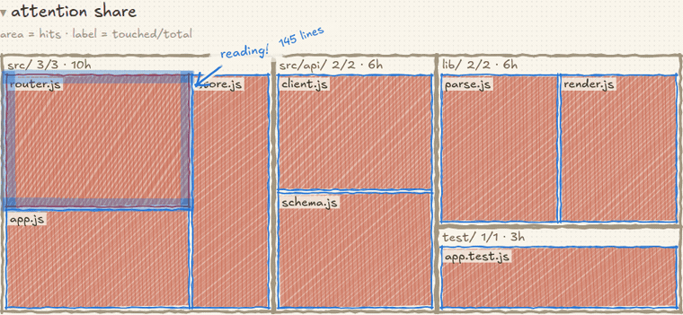

# ✳ claude-sketch

[English](README.md) · [한국어](README.ko.md) · [日本語](README.ja.md) · **中文**

> 🕵️ Claude 刚刚第六次读了 `fusion.py` —— 顺便去 `vendor/` 逛了一圈。
> 你完全不知道。现在你知道了。

用蜡笔实时画出 **Claude Code** 正在动的文件。🖍️

```bash
npx claude-sketch
```

<picture>
  <source media="(prefers-color-scheme: dark)" srcset="docs/live-dark.gif">
  
</picture>

## 👀 你能看到

- 👣 **足迹** —— 仓库里的每个文件。涂色 = 踩过，虚线 = 擦肩而过，`⋯16⋯` = 压根没靠近。覆盖率以该会话真正工作的仓库为分母 —— 已跟踪的文件，加上未被忽略的文件。
- 🎯 **注意力占比** —— **面积 = 工具调用次数**的树图。一个文件吃掉三分之一画面，这张图本身就是警告。
- 🔥 **文件热度** —— 5 分钟 / 1 小时 / 整场会话。读-读-改-跑…或者读-读-读-读。😬
- 📂 **切换文件夹** —— 页眉列出 Claude Code 干过活的所有文件夹（路径从记录里还原），无需重启。
- 🧠 **智能体** —— `main ─task▶ 子智能体`，带模型、任务说明、状态和耗时。点一下就只看它。
- 📝 **边注** —— “读了 6 次，多半已在上下文里”“戳了 `vendor/` 9 次”“编辑 → 运行 的循环 👍”。
- ✂️ **删除与增减** —— Bash 里的 `rm` 会带删除线，编辑标注 `+12 −3`。

## 💸 谁都没想到的数字

```
新输入 485 · 缓存 8.4M (100% 复用) · 输出 10.6k · 按 API 价约 $0.03
```

Claude 每一轮几乎都从缓存重放整个上下文。“输入 840 万 token” 😱 毫无意义，
真正花钱的是那个 **485**。价目表在 `~/.claude-sketch.pricing.json` 里改。
订阅套餐本来就不按 token 计费，请把它读作*工作量*，不是账单。
失败的调用也会计数 —— 那是纯粹的浪费。❌

## 🎛️ 选项

| | |
|---|---|
| `-p, --project <dir>` | 观察对象（默认：当前目录） |
| `--port <n>` | 默认 4517 —— **被占用就跳到下一个空闲端口** |
| `--strict-port` | 不跳端口，直接失败 |
| `-d, --detach` | 放到后台运行，把终端还给你 |
| `--host <addr>` | 默认 `127.0.0.1`（换成别的会大声警告 ⚠️） |
| `--open` / `--no-open` | 开不开浏览器 |
| `-v, --version` · `-h, --help` | 🙂 |

## ⚙️ 原理

Claude Code 早就把每个事件写进 `~/.claude/projects/<slug>/<会话>.jsonl`
（子智能体在 `<会话>/subagents/**`），设置了 `CLAUDE_CONFIG_DIR` 就在那里。
claude-sketch 监视并 tail 这些文件，
取出 `tool_use` + `message.model` + `message.usage`，再用 SSE 推给浏览器。

**是实测，不是估算。** 没有数据库、没有构建、没有框架，**零依赖**。📦

## ⚡ 性能

| | |
|---|---|
| 空闲 CPU（浏览器已连接） | 单核的 **0.06%** |
| 内存 | 约 60MB（最差 105MB） |
| 260MB 记录首次解析 | **1.7 秒** |
| 一次工具调用抵达浏览器 | **41ms**（8 个并行智能体下最差 121ms） |
| 轮询接口 (`/api/sessions`) | 1–5ms |
| 切到 115 个会话的项目 | 50ms，之后约 1ms |
| 浏览器整页重绘 | 约 30ms，堆 4MB |

## 🔒 隐私

要紧的地方只读 —— 你的项目和 `~/.claude` 底下什么都不写。
唯一会写的是临时目录里的一个标记文件，用来让重启时知道标签页是否已经开着。只绑定 `127.0.0.1`。
并拒绝以域名到达或来自其他源的请求。点击文件会**先询问**。外部请求为零 —— 字体也一并打包，
断网也能用。🏠

## 🎨 细节

- **语言**：🇬🇧 🇰🇷 🇯🇵 🇨🇳 —— 页眉一行，新增一种就往 `I18N` 加一个对象。
- **字体**：Excalifont（拉丁）、Gaegu（韩文）、Klee One（日文）、Ma Shan Zheng（中文）——
  均为 **SIL Open Font License 1.1**，已做子集并随包分发。覆盖范围与重新生成方式见
  [`public/fonts/README.md`](public/fonts/README.md)。改 `--hand` 变量即可替换。
- **`n 次调用 · 0 个文件`** 不是 bug —— shell 命令本来就不指向文件。
- task 耗时 = *启动→结果* 与 *智能体自身 首次→末次调用* 中**较长**的那个
  （有些记录把这两点写成相差 0.1 秒 🙃）。

## 📄 许可

MIT。不是 Anthropic 官方产品 —— 只是给想知道自己智能体在干什么的人做的工具。✳
